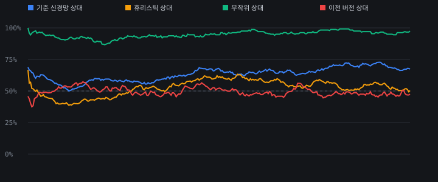

# 학습 성적표

- 반복 **228회차**까지 진행
- 기준 신경망 상대 승률: **54%**  ← 이게 계속 오르면 세지는 중
- 휴리스틱 상대 승률: **46%**
- 무작위 상대 승률: **92%**
- 손실: 정책 1.5987 / 가치 0.2189
- 신경망 교체 횟수: 70회

| 회차 | 기준망 | 휴리스틱 | 무작위 | 이전판 | 교체 | 정책손실 | 가치손실 | 초 |
|---|---|---|---|---|---|---|---|---|
| 189 | 75% | 50% | 83% | 50% |  | 1.5839 | 0.2595 | 85.8 |
| 190 | 79% | 46% | 100% | 44% |  | 1.5875 | 0.2668 | 87.1 |
| 191 | 92% | 29% | 100% | 77% | O | 1.5911 | 0.2738 | 84.7 |
| 192 | 75% | 42% | 100% | 58% | O | 1.5866 | 0.2466 | 86.6 |
| 193 | 79% | 21% | 100% | 44% |  | 1.5802 | 0.2398 | 85.6 |
| 194 | 50% | 50% | 92% | 44% |  | 1.5859 | 0.2456 | 86.5 |
| 195 | 67% | 67% | 92% | 44% |  | 1.5871 | 0.2524 | 83.2 |
| 196 | 83% | 42% | 100% | 38% |  | 1.5889 | 0.2582 | 84.7 |
| 197 | 79% | 50% | 100% | 46% |  | 1.5951 | 0.2637 | 86.5 |
| 198 | 79% | 79% | 83% | 56% | O | 1.5984 | 0.2729 | 86.3 |
| 199 | 83% | 71% | 92% | 52% |  | 1.5904 | 0.2469 | 84.8 |
| 200 | 62% | 38% | 96% | 44% |  | 1.5921 | 0.2544 | 85.3 |
| 201 | 58% | 58% | 100% | 52% |  | 1.5963 | 0.2605 | 86.8 |
| 202 | 75% | 54% | 100% | 48% |  | 1.6009 | 0.2664 | 86.7 |
| 203 | 92% | 42% | 100% | 46% |  | 1.6027 | 0.2721 | 85.0 |
| 204 | 79% | 33% | 96% | 54% |  | 1.6056 | 0.2801 | 85.5 |
| 205 | 75% | 50% | 88% | 75% | O | 1.6062 | 0.2871 | 86.2 |
| 206 | 62% | 50% | 83% | 50% |  | 1.6009 | 0.2504 | 86.9 |
| 207 | 75% | 17% | 100% | 58% | O | 1.6057 | 0.2582 | 84.8 |
| 208 | 75% | 58% | 75% | 46% |  | 1.5992 | 0.2417 | 86.2 |
| 209 | 75% | 29% | 96% | 44% |  | 1.602 | 0.2485 | 86.7 |
| 210 | 54% | 75% | 100% | 54% |  | 1.6075 | 0.2576 | 87.2 |
| 211 | 71% | 50% | 100% | 58% | O | 1.6103 | 0.2634 | 85.5 |
| 212 | 58% | 33% | 100% | 56% | O | 1.6032 | 0.2391 | 86.8 |
| 213 | 67% | 46% | 83% | 44% |  | 1.5993 | 0.2257 | 87.2 |
| 214 | 67% | 42% | 100% | 73% | O | 1.6026 | 0.2357 | 84.9 |
| 215 | 54% | 25% | 92% | 67% | O | 1.6014 | 0.2246 | 86.1 |
| 216 | 75% | 42% | 100% | 50% |  | 1.594 | 0.2195 | 84.5 |
| 217 | 33% | 54% | 96% | 35% |  | 1.5984 | 0.2259 | 86.9 |
| 218 | 100% | 54% | 100% | 56% | O | 1.6024 | 0.2328 | 85.2 |
| 219 | 75% | 33% | 100% | 67% | O | 1.599 | 0.2179 | 85.7 |
| 220 | 88% | 42% | 96% | 60% | O | 1.5953 | 0.2143 | 84.3 |
| 221 | 42% | 50% | 100% | 46% |  | 1.5912 | 0.2114 | 85.7 |
| 222 | 75% | 75% | 100% | 50% |  | 1.5934 | 0.2198 | 83.8 |
| 223 | 75% | 54% | 100% | 33% |  | 1.5975 | 0.2241 | 86.0 |
| 224 | 67% | 58% | 100% | 67% | O | 1.6018 | 0.2341 | 87.6 |
| 225 | 75% | 42% | 100% | 50% |  | 1.5989 | 0.2174 | 85.8 |
| 226 | 62% | 42% | 100% | 69% | O | 1.601 | 0.2234 | 85.0 |
| 227 | 58% | 67% | 92% | 40% |  | 1.5956 | 0.2148 | 85.6 |
| 228 | 54% | 46% | 92% | 38% |  | 1.5987 | 0.2189 | 86.4 |

---

**보는 법**

- **기준 신경망 상대**가 제일 중요함. 학습 초기에 얼려 둔 신경망과 계속 붙여서, 이 승률이 꾸준히 오르면 진짜로 세지는 중임. 안 오르면 멈춘 것.
- 무작위 상대는 금방 100%에 붙음. 여기서 안 오르면 파이프라인 고장.
- 휴리스틱 상대는 '작은 판 딸 수 있으면 따고, 상대가 딸 자리는 막는' 단순한 봇. 이걸 넘기면 기본기는 된 것.
- 이전 버전 상대 승률이 교체 기준(55%)임. 계속 50% 근처면 더 이상 안 느는 중.
- 정책 손실이 회차가 가도 안 내려가면 탐색이 신경망보다 못하다는 뜻 → `sims`를 올려야 함.